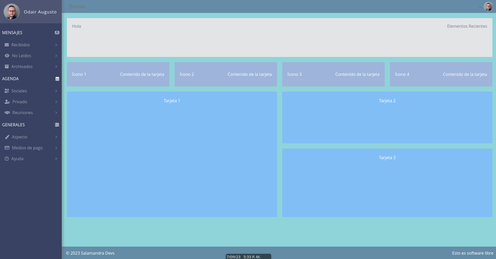

# HTML/CSS dashboard
Este es un dashboard responsivo hecho en html y css puro, contiene un poco de Javascript pero es apenas para los menues. Para los nombres
de las clases usa la filosofía BEM, la cual no recomiendo hoy en día, pero en el momento que lo realicé me parecía buena. Si alguien lo
quiere editar y dejarlo con selectores normales CSS3 bienvenido, incluso podríamos probar las nuevas reglas de CSS anidado, todos los aportes
son bienvenidos, forkea el sitio y manda el PR.

